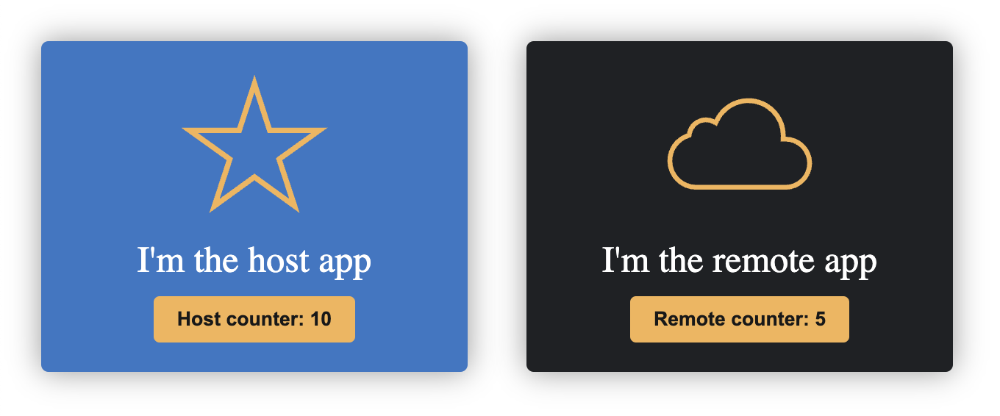

# React host and remote

## Getting started

From this directory execute:

- npm run install:deps
- npm run remote:preview
- npm run host:preview (in a different terminal)

Open your browser at http://localhost:4173/ to see the amazing result

